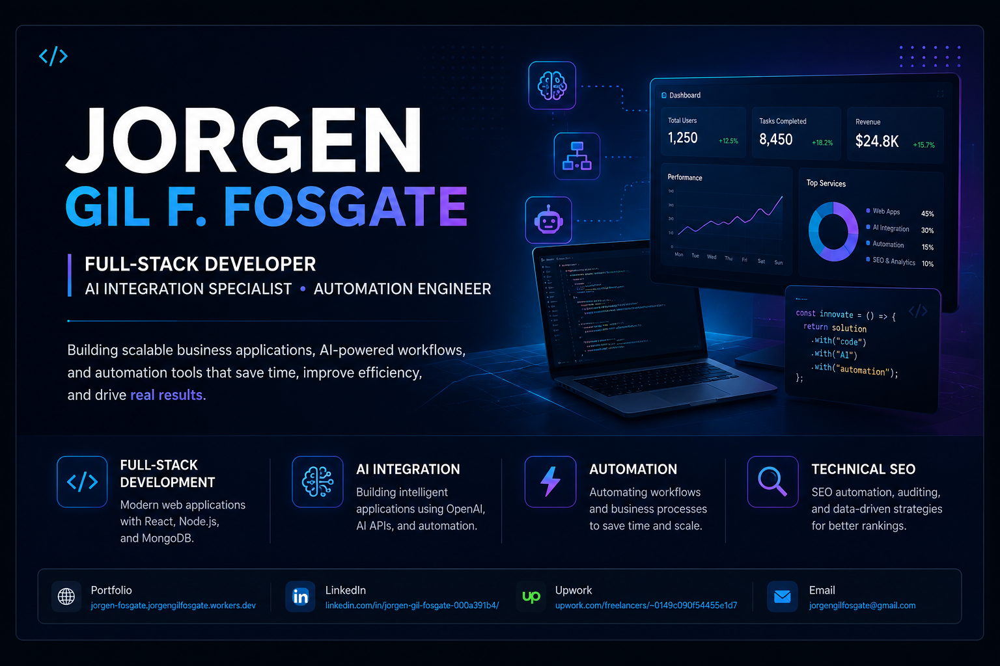

  

  

<h1 align="center">Hi 👋, I'm Jorgen Gil F. Fosgate</h1>

<h3 align="center">
Building modern web applications, AI-powered business solutions, and automation systems.
</h3>

---

# 👨‍💻 About Me

I'm a **Full-Stack Developer** from the **Philippines 🇵🇭** who enjoys building software that solves real business problems.

I specialize in:

- 🤖 AI Integration & Business Automation
- 💻 Full-Stack Web Development
- 📊 Internal Dashboards & CRM Systems
- ⚙️ Workflow Automation
- 🔍 Technical SEO & Web Optimization

Currently expanding my expertise in:

- AI Agents
- n8n Automation
- Claude API
- PostgreSQL
- Docker
- LangChain

---

# 📊 GitHub Statistics

---

# 💻 Tech Stack

---

# 🚀 Featured Projects

## 🏢 Prosper HRIS & Operations Dashboard

Enterprise HRIS and Operations Dashboard built with React, Node.js, MongoDB, and Firebase.

### Highlights

- Role-Based Authentication
- Employee Management
- Monitoring Dashboard
- Time Tracking
- Internal Operations
- REST API Integration

---

## 🤖 Benny AI Benefits Assistant

AI-powered employee benefits assistant utilizing OpenAI and Firebase.

### Highlights

- AI Conversations
- Prompt Engineering
- OpenAI Integration
- Authentication
- Business Workflows
- API Integrations

---

## 📊 Maptive SEO Audit Desktop

Desktop application designed for technical SEO auditing and reporting.

### Highlights

- Metadata Audit
- H1 Analysis
- Sitemap Crawling
- SEO Reporting
- Website Analysis

---

## 🐍 Python Automation Tools

Python-based automation projects focused on productivity and SEO.

### Highlights

- Web Scraping
- Google Sheets Integration
- Data Automation
- Batch Processing

---

# 🎯 Current Focus

- 🤖 AI Agents
- ⚡ Business Automation
- 🌐 SaaS Development
- 🧠 AI Integrations
- 📈 Technical SEO
- 🚀 Cloud Applications

---

# 📫 Let's Connect

<a href="https://jorgen-fosgate.jorgengilfosgate.workers.dev">Portfolio</a> •
<a href="https://www.linkedin.com/in/jorgen-gil-fosgate-000a391b4/">LinkedIn</a> •
<a href="https://www.upwork.com/freelancers/~0149c090f54455e1d7?mp_source=share">Upwork</a> •
<a href="mailto:jorgengilfosgate@gmail.com">Email</a>

---

⭐ Thanks for visiting my GitHub profile!

